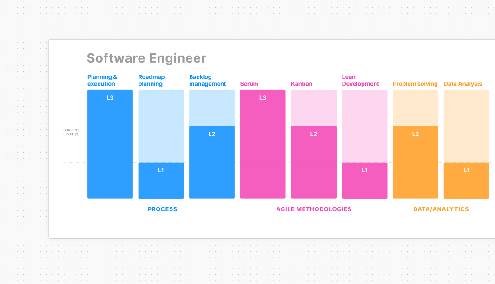

# Skill Chart + (Figma Widget)

> Based on the work of 
> - **Noah Levin**
>     -  [**Skills Chart**](https://www.figma.com/community/widget/1207836110040407856/skills-chart) -> [Source Code](https://github.com/nlevin/figmadesign/tree/main/SkillChart)
> - **Lala Azizli**
>    - [**Skill Chart for Product Owners**](https://www.figma.com/community/widget/1237852363698644601/skill-chart-for-product-owners) -> [Source Codee](https://github.com/lazizli/POlevels)

This Figma widget is designed to evaluate the competencies of professionals in various roles, such as Product Manger, UX Designer, Software Engineer, and Data Engineer. It helps in assessing skills across different categories, ensuring a comprehensive evaluation process.

## Roles

The widget evaluates competencies for the following roles:

- **Product Manager**
- **Software Engineer**
- **UX Designer**
- **Engineering Manager**
- **Data Engineer**
- **Data Scientist**
- **Data Analyst**

## Categories

The competencies are organizer across the following categories:

1. **Domain knowledge**
2. **Process**
3. **Agile Methodologies**
4. **Data/Analytics**
5. **UX/UI**
6. **Software Development**
7. **Behavior**
8. **Leadership**
9. **Mindset**

## Competencies and Levels

Each competency is detailed with descriptions at three levels of proficiency:

- **Level 1:** Basic knowledge and skills.
- **Level 2:** Intermediate proficiency with the ability to apply skills effectively.
- **Level 3:** Expert-level proficiency with the ability to lead and mentor others.

## Competencies

- **[Competencies x Role Table and Descriptrions](./docs/skill-descriptions.md)**

## Usage

1. **Installation:**
   - Open Figma and go to the Community section.
   - Search for the "Competency Evaluation Widget" and click "Install".

2. **Setup:**
   - Open a project in Figma.
   - Add the Competency Evaluation Widget to your canvas.

3. **Evaluation:**
   - Select the role you want to evaluate (UX Designer, Software Engineer, Data Engineer, etc.).
   - Browse through the categories and competencies.
   - Use the level descriptions to assess the individual's proficiency in each competency.

4. **Customization:**
   - You can customize the widget to add or modify competencies as per your organization's needs.

## Contributing

We welcome contributions to enhance the widget. Please follow these steps:

1. Fork the repository.
2. Create a new branch (`git checkout -b feature/your-feature-name`).
3. Commit your changes (`git commit -m 'Add some feature'`).
4. Push to the branch (`git push origin feature/your-feature-name`).
5. Open a pull request.

## License

This project is licensed under the MIT License. See the `LICENSE` file for details.

## Contact

For any questions or feedback, please open an issue.

